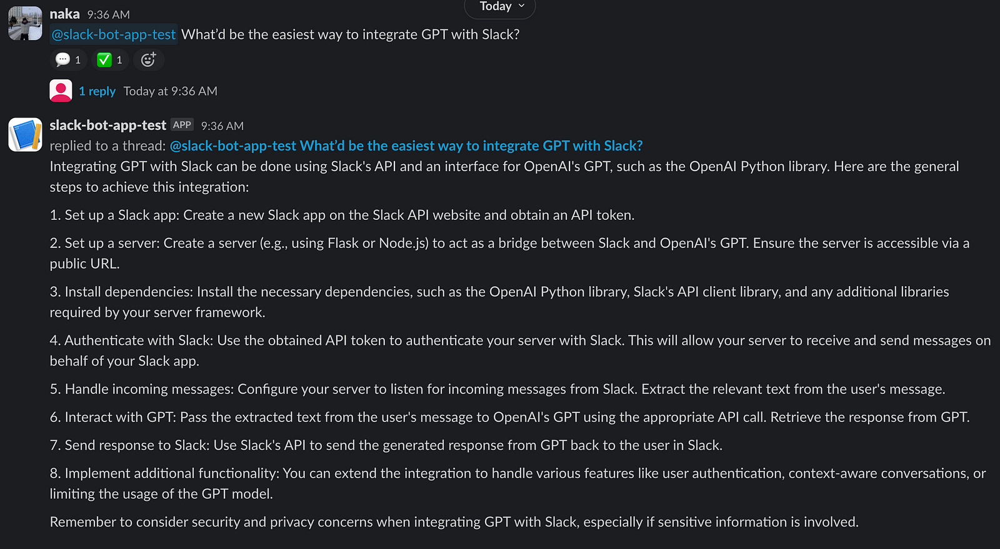

# slack-gpt

Slack GPT integration



## Slack Bot setting

1. Crete a Slack bot https://api.slack.com/apps/
1. [URL verification](https://api.slack.com/events/url_verification)
1. Configure Event Subscriptions
    - Request URL: https://xxxxx/slack/events
    - Subscribe to bot events: `app_mention`, `chat:write`, `reactions:write`, `reactions:read`

## Local

```
poetry install
```

```
poetry run gunicorn --bind :8080 slack_gpt.main:app
```


```
curl -H 'Content-Type: application/json' -X POST -d '{"type": "url_verification", "challenge": "test"}' localhost:8080/slack/events
{
  "challenge": "test"
}
```

## Deploy to Cloud Run

```
PROJECT=xxxx
REGION=asia-northeast1
SA_NAME=slack-gpt
```

```
poetry export -f requirements.txt --output requirements.txt
```

```
gcloud iam service-accounts create $SA_NAME --project $PROJECT
```

```bash
# slack bot token
gcloud secrets create slack-bot-token --replication-policy automatic --project $PROJECT
echo -n "xoxb-xxx" | gcloud secrets versions add slack-bot-token --data-file=- --project $PROJECT
gcloud secrets add-iam-policy-binding slack-bot-token \
    --member="serviceAccount:${SA_NAME}@${PROJECT}.iam.gserviceaccount.com" \
    --role="roles/secretmanager.secretAccessor" --project ${PROJECT}

# slack signing secret
gcloud secrets create slack-signing-secret --replication-policy automatic --project $PROJECT
echo -n "xxx" | gcloud secrets versions add slack-signing-secret --data-file=- --project $PROJECT
gcloud secrets add-iam-policy-binding slack-signing-secret \
    --member="serviceAccount:${SA_NAME}@${PROJECT}.iam.gserviceaccount.com" \
    --role="roles/secretmanager.secretAccessor" --project ${PROJECT}

# openai organization
gcloud secrets create openai-organization --replication-policy automatic --project $PROJECT
echo -n "xxx" | gcloud secrets versions add openai-organization --data-file=- --project $PROJECT
gcloud secrets add-iam-policy-binding openai-organization \
    --member="serviceAccount:${SA_NAME}@${PROJECT}.iam.gserviceaccount.com" \
    --role="roles/secretmanager.secretAccessor" --project ${PROJECT}

# openai api key
gcloud secrets create openai-api-key --replication-policy automatic --project $PROJECT
echo -n "xxx" | gcloud secrets versions add openai-api-key --data-file=- --project $PROJECT
gcloud secrets add-iam-policy-binding openai-api-key \
    --member="serviceAccount:${SA_NAME}@${PROJECT}.iam.gserviceaccount.com" \
    --role="roles/secretmanager.secretAccessor" --project ${PROJECT}
```

build

```
gcloud builds submit . --pack "image=$REGION-docker.pkg.dev/$PROJECT/cloud-run-source-deploy/slack-gpt:$(date '+%Y%m%d%H%M%S')" --project ${PROJECT}
```

<details><summary>initial deploy</summary>

```
gcloud run deploy slack-gpt \
    --source . \
    --platform managed \
    --region $REGION \
    --allow-unauthenticated \
    --service-account ${SA_NAME}@${PROJECT}.iam.gserviceaccount.com \
    --set-secrets=SLACK_BOT_TOKEN=slack-bot-token:latest \
    --set-secrets=SIGNING_SECRET=slack-signing-secret:latest \
    --set-secrets=OPENAI_ORGANIZATION=openai-organization:latest \
    --set-secrets=OPENAI_API_KEY=openai-api-key:latest \
    --project ${PROJECT}
```

```
gcloud run services describe slack-gpt --format export --project $PROJECT --region $REGION > service.yaml
```

</details>

```
gcloud run services replace service.yaml --project $PROJECT --region $REGION
```

```
URL=$(gcloud run services describe slack-gpt --project $PROJECT --region ${REGION} --format json | jq -r .status.url)
```

check

```
curl -H 'Content-Type: application/json' -X POST -d '{"type": "url_verification", "challenge": "test"}' $URL/slack/events
{"challenge": "test"}
```

## Ref

- https://slack.dev/bolt-python/tutorial/getting-started
- [Slack Event retries](https://api.slack.com/apis/connections/events-api#retries): ``
